## EV Grid Oracle — Bangalore’s EV Dispatch “Oracle”

An **OpenEnv RL environment** that simulates Bangalore’s EV charging grid and trains a small LLM (Qwen2.5‑3B) with **verifiable GRPO rewards** to route EVs in real time — **lower queues**, **avoid feeder stress**, **shift load to renewables**.

### OpenEnv Hackathon 2026 — theme fit (pick a primary; justify in pitch)

| Theme | How EV Grid Oracle aligns |
|------|----------------------------|
| **#3 World modeling (primary)** | **Partially observable** grid + queues + **strict tool-like** actions; rewards come from **simulator + verifier** (`ev_grid_oracle/reward.py`), not from the model grading itself. Optional **world-model head** in training (`SimulationPrediction` + verifier in `training/train_grpo.ipynb`). |
| **#2 Long horizon (primary)** | Multi-step episodes (`reset` / `step` over many ticks), **delayed** stress from **scheduled scenarios** (`ev_grid_oracle/scenarios.py`), recovery from early mistakes visible in replay. |
| **#1 Multi-agent (primary)** | **Explicit multi-agent protocol**: **GridOperator** publishes a verifiable directive (`/ma/*`), **FleetDispatcher** routes EVs under that constraint, and we score **role rewards** + negotiation signal (`ev_grid_oracle/multi_agent.py`, `ev_grid_oracle/reward.py`). The demo UI includes **Judge Mode (MA)** with a negotiation timeline. |
| **#4 Self-improvement** | Scenario curriculum + trap catalog (`docs/judge-kit/trap-catalog.md`) are a hook for **adaptive difficulty**; training can reweight scenarios (future work). |
| **#5 Wild card** | Spatial **Bangalore graph** + **City Ops** demo + paired statistical eval are the differentiated story. |

**Dual framing:** OpenEnv Hackathon + AI for Bharat (BESCOM Theme 9).

### Judges — non‑negotiables (all links in one place)

Submissions are expected to meet the official checklist **with public URLs only** (do **not** commit large video binaries to the Hub Space repo).

| Requirement | Where |
|---------------|--------|
| **OpenEnv (build on the framework)** | This repo uses **`openenv-core>=0.2.3`** on [PyPI](https://pypi.org/project/openenv-core/) (current release line), plus [`openenv.yaml`](openenv.yaml) and the FastAPI server under `server/`. |
| **Runnable env on Hugging Face Spaces** | [**Space (card)**](https://huggingface.co/spaces/NITISHRG15102007/ev-grid-oracle) · [**Live app**](https://nitishrg15102007-ev-grid-oracle.hf.space) |
| **Training script (TRL + Unsloth, re‑runnable)** | [**Open in Colab**](https://colab.research.google.com/github/NITISH-R-G/ev-grid-oracle/blob/main/training/train_grpo.ipynb) · [Notebook on GitHub](https://github.com/NITISH-R-G/ev-grid-oracle/blob/main/training/train_grpo.ipynb) · same file in repo: [`training/train_grpo.ipynb`](training/train_grpo.ipynb) |
| **Evidence of real training (loss + reward)** | After a GPU run, TensorBoard logs land in `ev_oracle_grpo_road/`. Export PNGs: `python tools/export_grpo_tensorboard_plots.py --logdir ev_oracle_grpo_road --out-dir artifacts` → commit **`artifacts/grpo_loss.png`** and **`artifacts/grpo_reward.png`** (see [training artifacts doc](docs/submission/training-artifacts-and-logs.md)). *Until those exist from your run, add them before final submission.* |
| **Mini‑blog or under‑2‑minute video (link only)** | **Writeup:** [HF mini‑blog source (markdown)](https://github.com/NITISH-R-G/ev-grid-oracle/blob/main/docs/hf-mini-blog-ev-grid-oracle.md) — paste into a Hub post or link the raw file. **Video:** *add your YouTube/HF public URL when ready* — shot list: [`docs/submission/youtube-under-2min-outline.md`](docs/submission/youtube-under-2min-outline.md). |
| **Adapter weights (optional but linked)** | [LoRA on Hub](https://huggingface.co/NITISHRG15102007/ev-oracle-lora) |
| **Extra materials** | Judge kit: [`docs/judge-kit/credit-assessment-pattern-map.md`](docs/judge-kit/credit-assessment-pattern-map.md) · official resources: [`docs/hackathon-official-resources.md`](docs/hackathon-official-resources.md) |

**Eval / behavior evidence (complements GRPO curves):** paired baseline vs oracle plots live under `artifacts/` (see [Evidence & visualizations](#evidence--visualizations-baseline-vs-oracle--judge-pack) below).

### How this maps to judging (40 / 30 / 20 / 10)

| Criterion (weight) | What judges ask | Where we answer |
|--------------------|-----------------|-----------------|
| **Environment innovation (40%)** | Novel, hard to game, tests behavior | Graph routing + **anti-cheat flags**, deterministic **stress scenarios**, Phaser command center + replay (`web/`). |
| **Storytelling (30%)** | Problem → env → what changed → why it matters | This README + [`docs/hf-mini-blog-ev-grid-oracle.md`](docs/hf-mini-blog-ev-grid-oracle.md) + Space demo. |
| **Improvement in rewards / behavior (20%)** | Before vs after, same seeds | **Paired** `training/evaluate.py`, plots below, `training/fair_eval.py` (Wilson + McNemar on `per_episode`). |
| **Reward & pipeline (10%)** | Coherent reward, training hooks env | `ev_grid_oracle/reward.py` breakdown + `training/train_grpo.ipynb` (GRPO + `reward_fn` stepping `EVGridCore`). |

### Why judges will care (fast)
- **It’s verifiable**: every action parsed + validated; reward breakdown logged (anti‑hack by design).
- **It’s visual**: live “city map” with station heat, queues, arrows, HUD.
- **It shows learning**: baseline vs oracle KPIs + reward curves + replayable seeds.

---

## What’s in this repo

- **Environment (this Space)**: FastAPI server exposing `EVGridEnvironment` (OpenEnv interface).
- **Demo UI**: `viz/gradio_demo.py` (baseline vs oracle toggle + streaming “Run 60 ticks”).
- **2D recording**: `viz/city_map.py`, `viz/record_two_phase.py` (baseline → oracle 2‑minute frames).
- **Training**: `training/train_grpo.ipynb` (Colab T4 GRPO with verifier rewards).
- **Evidence**: paired `training/evaluate.py` + `training/fair_eval.py` + **`training/make_plots.py`** (multi-figure suite: KPIs, trajectories, deltas, breakdowns, boxplots, win rates, McNemar, dashboard — all under `artifacts/`).
- **Judge kit (repo-specific checklist)**: `docs/judge-kit/credit-assessment-pattern-map.md`
- **HF mini-blog (markdown article in repo)**: `docs/hf-mini-blog-ev-grid-oracle.md`
- **Official hackathon links (OpenEnv + HF Hub + tutorials + papers)**: `docs/hackathon-official-resources.md`
- **Trap catalog (scenarios + verifier flags)**: `docs/judge-kit/trap-catalog.md`
- **Local validation**: `./validate-submission.sh` → `assets/validation_output.txt` (gitignored; see `assets/README.md`)

### Web command center (`web/` + Space static UI)

- **Judge tour**: open the Space with `?tour=1` (combine with `seed`, `scenario`, `fleet`, `follow`, `lora`, `judge` query params).
- **Shareable state**: after **New** / **Step** / **Run**, the log prints a `share:` URL you can copy for the same seed/scenario.
- **Export JSON**: **Export JSON** downloads the recorded baseline/oracle step frames (map stills: use your OS screenshot tool).
- **Route rendering**: **traveled vs remaining** polyline styling; long OSM paths are **decimated** for smoother Deck.gl performance.

**Eval snapshot (no LLM):** `python tools/write_eval_snapshot.py` writes `artifacts/eval_snapshot.json` (paired baseline vs oracle with `ORACLE_SKIP_LLM=1`).

---

## Quick links (fill these in before submission)

- **OpenEnv Space (env)**: `https://huggingface.co/spaces/NITISHRG15102007/ev-grid-oracle`
- **Live host**: `https://nitishrg15102007-ev-grid-oracle.hf.space`
- **GitHub**: `https://github.com/NITISH-R-G/ev-grid-oracle`
- **Colab (opens `main` notebook on a clean VM)**: `https://colab.research.google.com/github/NITISH-R-G/ev-grid-oracle/blob/main/training/train_grpo.ipynb`
- **Notebook source (same file as Colab)**: `https://github.com/NITISH-R-G/ev-grid-oracle/blob/main/training/train_grpo.ipynb`
- **HF mini-blog / article (markdown in this repo — paste into a Hub post or link raw)**: `https://github.com/NITISH-R-G/ev-grid-oracle/blob/main/docs/hf-mini-blog-ev-grid-oracle.md`
- **2‑minute video**: TODO (YouTube/HF post link) — shot list: [`docs/submission/youtube-under-2min-outline.md`](docs/submission/youtube-under-2min-outline.md)
- **LoRA repo**: `https://huggingface.co/NITISHRG15102007/ev-oracle-lora`

**Submission tips:** Hugging Face accepts long-form writeups as **markdown in your repo** (see `docs/hf-mini-blog-ev-grid-oracle.md`). Keep the **Colab link** and **GitHub `.ipynb` link** both in the README so judges can open Colab directly or review the notebook on GitHub. The training notebook’s **first code cell clones this repo and `pip install -e .`** so Colab runs stay reproducible.

### Submission bundle (env + training scripts + logs)

| Deliverable | Where |
|-------------|--------|
| Shared **environment** | HF Space + `openenv.yaml` (links above) |
| **Training script** | [`training/train_grpo.ipynb`](training/train_grpo.ipynb) (+ Colab quick link) |
| **Eval / fair-stats scripts** | `training/evaluate.py`, `training/fair_eval.py`, `training/make_plots.py` |
| **Training logs** (GRPO) | TensorBoard under `ev_oracle_grpo_road/` during a run; export PNGs or a console tail — **[`docs/submission/training-artifacts-and-logs.md`](docs/submission/training-artifacts-and-logs.md)** |
| **Eval evidence** (JSON + plots) | `training/eval_results.json`, `artifacts/fair_eval_results.json`, `artifacts/*.png` |
| **Video storyboard** | [`docs/submission/youtube-under-2min-outline.md`](docs/submission/youtube-under-2min-outline.md) |

### Official hackathon resources (OpenEnv + HF + tutorials)

Full list with descriptions: [`docs/hackathon-official-resources.md`](docs/hackathon-official-resources.md).

| Resource | Link |
|----------|------|
| OpenEnv Core (GitHub) | https://github.com/meta-pytorch/OpenEnV |
| OpenEnv docs | https://meta-pytorch.org/OpenEnv/ |
| HF OpenEnv environments | https://huggingface.co/openenv |
| HF OpenEnv Spaces | https://huggingface.co/openenv/spaces |
| Tutorials (tree) | https://github.com/meta-pytorch/OpenEnv/tree/main/tutorial |
| Training examples | https://github.com/meta-pytorch/OpenEnv/tree/main/tutorial/examples |
| Environment examples | https://github.com/meta-pytorch/OpenEnv/tree/main/envs |
| Reward papers | https://arxiv.org/abs/2408.10215 · https://arxiv.org/abs/2601.19100 |

**YouTube (RL envs):** [0airz7BhBiA](https://www.youtube.com/watch?v=0airz7BhBiA) · [ap4q4sAK4OY](https://www.youtube.com/watch?v=ap4q4sAK4OY) · [Jew4lhAiqnw](https://www.youtube.com/watch?v=Jew4lhAiqnw) · [kkCNMz0Ptd8 (live)](https://www.youtube.com/live/kkCNMz0Ptd8?si=JJ7og8x5qc7_Gi0e)

---

## The environment (OpenEnv)

This Space hosts the **OpenEnv‑compatible FastAPI server** for `EVGridEnvironment`.

### Endpoints

- `POST /reset`
- `POST /step`
- `GET /state`
- `GET /schema`
- `GET /health`

### Action format (strict)

The agent must respond in this exact schema (parsed by a deterministic regex):

```text
ACTION: route|defer|load_shift
STATION: BLR-01..BLR-25 or NONE
CHARGE_RATE: slow|fast|ultra_fast
DEFER_MINUTES: integer
REASON: max 20 words
CONFIDENCE: 0.0-1.0
```

### Road-graph RL (connected-edge actions)

This repo also includes a road-graph RL environment mounted under `POST /road/reset` and `POST /road/step`.
Its action schema is:

```text
CURRENT_NODE: <int>
NEXT_NODE: <int>
REASON: max 20 words
CONFIDENCE: 0.0-1.0
```

### Reward (verifiable + anti‑hack)

Total reward is the sum of components (each logged) in `ev_grid_oracle/reward.py`:
- **wait**: penalize average station wait
- **grid_stress**: penalize overloaded stations (>85% capacity)
- **peak**: penalize feeder load > 80%, bonus below it
- **renewable**: reward green windows
- **urgency**: punish deferring critical EVs
- **anti‑hack**: punish impossible routes / queue piling

---

## Demo + Visualization

### Gradio demo (interactive)

Run locally:

```bash
python -m viz.gradio_demo
```

What judges see:
- map heat (green → red), queue dots, live KPIs
- mode toggle: baseline vs oracle
- **Run 60 ticks** streaming button (looks “alive”)

### Pygame cinematic map (for recording)

```bash
python -m viz.city_map
```

Press **SPACE** to advance simulation ticks.

### 2‑minute screen‑record pipeline (baseline → oracle)

```bash
python -m viz.record_two_phase --seed 123 --out artifacts/frames_2min
```

Then:

```bash
ffmpeg -framerate 30 -i frame_%06d.png -c:v libx264 -pix_fmt yuv420p out.mp4
```

---

## Evidence & visualizations (baseline vs oracle — judge pack)

All figures below are generated from **`training/eval_results.json`** (`per_episode` rows = same world, two policies) and **`artifacts/fair_eval_results.json`**. Regenerate in one pass:

```bash
export ORACLE_LORA_REPO="NITISHRG15102007/ev-oracle-lora"   # optional; use GPU + real LoRA for separation
# ORACLE_SKIP_LLM=1  → baseline fallback inside oracle path (sanity / CI only)
python training/evaluate.py --episodes 72 --seed 7 --scenario baseline --out training/eval_results.json
python training/fair_eval.py --eval-json training/eval_results.json --out-json artifacts/fair_eval_results.json --out-chart artifacts/fair_eval_chart.png
python training/make_plots.py --eval-json training/eval_results.json --fair-json artifacts/fair_eval_results.json --out-dir artifacts
```

**How to read these when policies match:** if oracle falls back to baseline, trajectories and scatter collapse on top of each other — that proves **paired harness is correct**. After GRPO + LoRA, you want **divergence** on wait / peak / stress and **higher oracle win rates**.

### 1) Aggregate KPIs (mean over paired episodes)


### 2) One-page dashboard (trajectory + deltas + scatter + win rate)

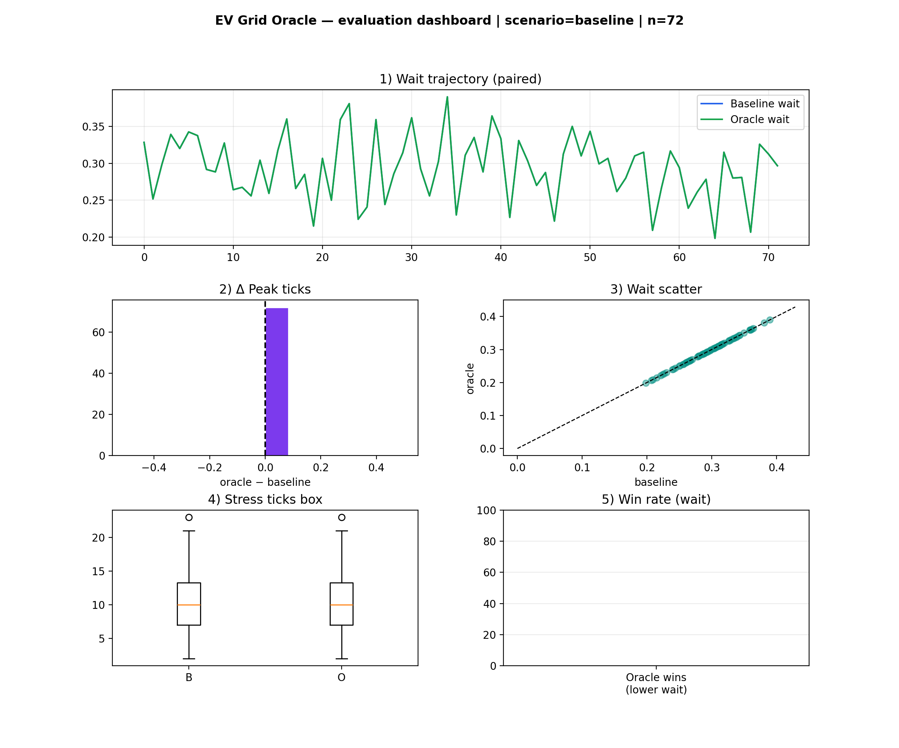

### 3) Per-episode trajectories (paired seeds)

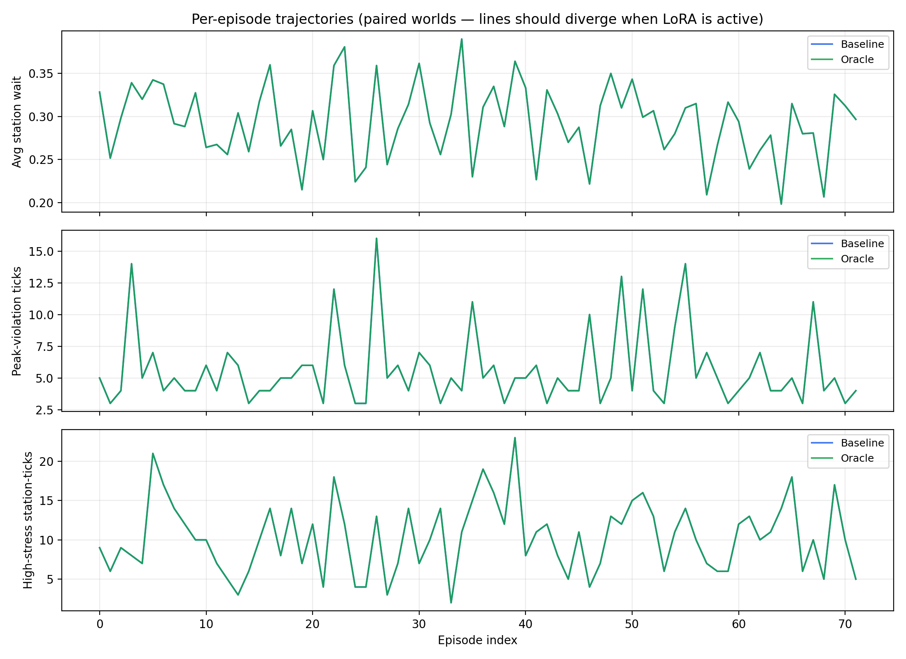

### 4) Paired deltas (oracle − baseline)

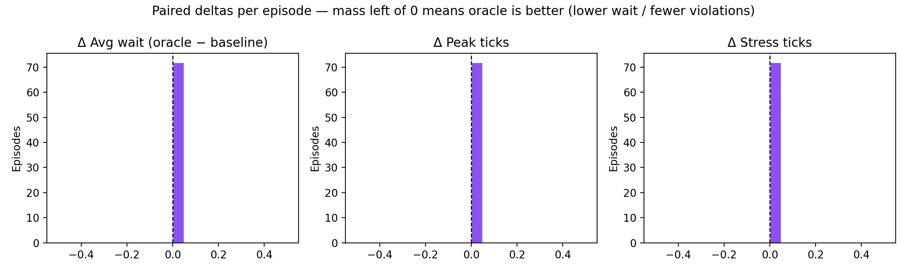

### 5) Verifier reward breakdown (mean components)

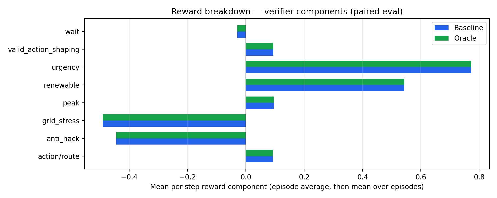

### 6) Distributions over episodes (boxplots)

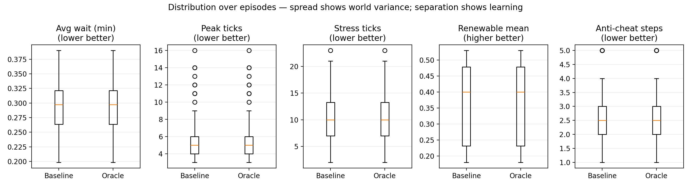

### 7) Head-to-head win rate (% episodes oracle wins outright)

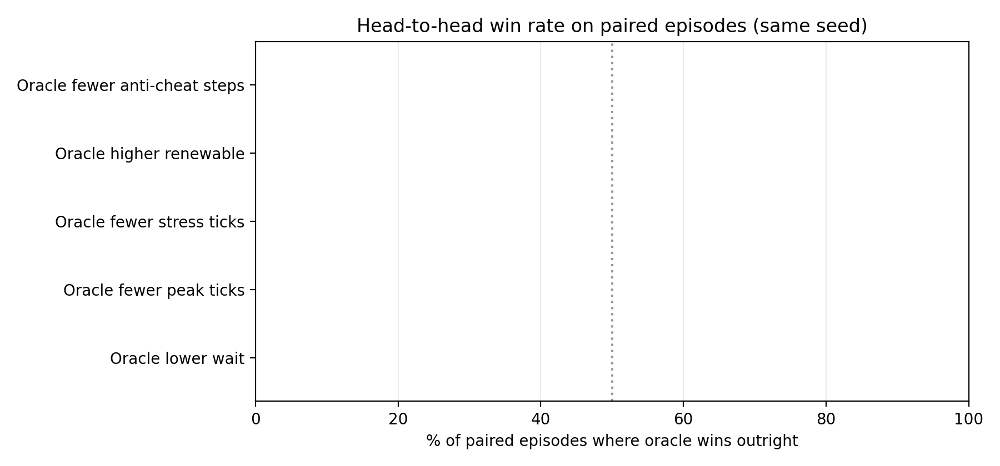

### 8) Paired scatter — wait (y = x means no change)

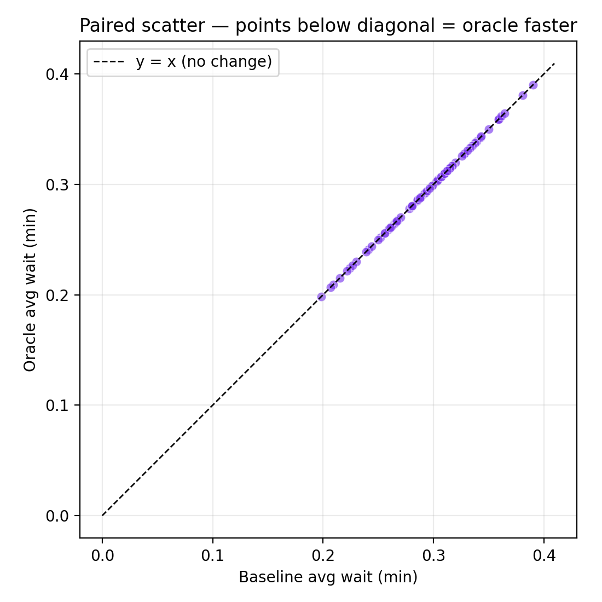

### 9) Baseline binary stress timeline (which episodes were “hard”)

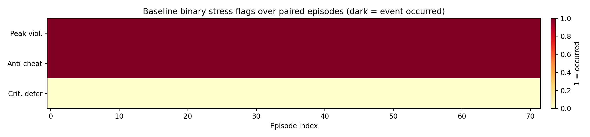

### 10) Wilson rates on binary outcomes (from `fair_eval_results.json`)

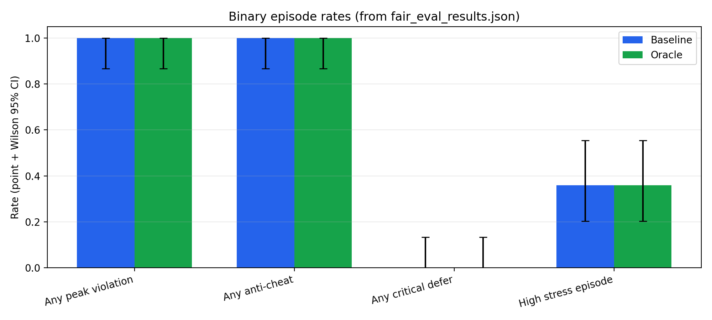

### 11) Wilson chart (errorbar plot from `fair_eval.py`)

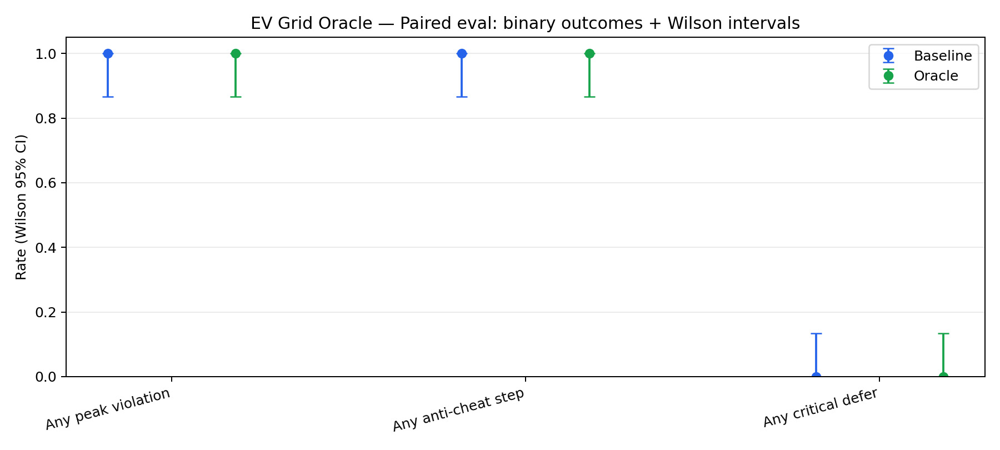

### 12) McNemar p-values (paired discordant-binomial test)

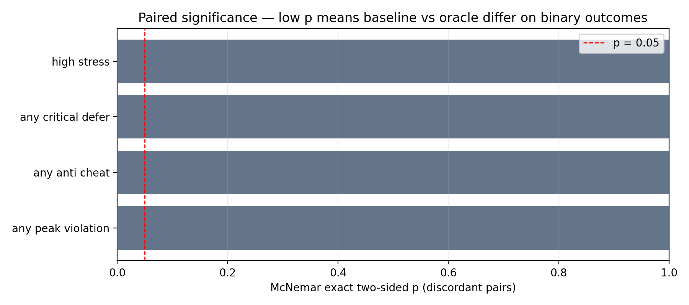

`artifacts/fair_eval_results.json` also stores **`paired_mcnemar`** tables for the full numeric report.

### GRPO training curves (loss / reward vs step)

TRL / Unsloth logs are most trustworthy when exported from a real run. In `training/train_grpo.ipynb`, `GRPOConfig` uses `report_to=["tensorboard"]` (logs under `ev_oracle_grpo_road/`). Train on GPU, then add **exported PNGs** (`artifacts/grpo_loss.png`, `artifacts/grpo_reward.png` via `tools/export_grpo_tensorboard_plots.py` or TensorBoard screenshots) or a console tail under `artifacts/training_logs/` — see [`docs/submission/training-artifacts-and-logs.md`](docs/submission/training-artifacts-and-logs.md). Judges reward **labeled axes** and **same-run** comparisons.

Note: On CPU-only machines, loading a 3B model can be slow or fail; use **Colab GPU** for final “evidence of learning” artifacts and training curves.

---

## Training (Colab T4)

Open:
- `training/train_grpo.ipynb`

Notes:
- start with 1 epoch + small `num_generations`, then scale
- sample rollouts every N steps to detect reward hacking

> If you’re using LoRA/QLoRA, don’t naively upcast a 4-bit base to 16-bit and “merge” at the end without the correct path — it can badly degrade quality. Save adapters cleanly and test post-training inference immediately.

### Local dev

```bash
python -m uvicorn server.app:app --host 0.0.0.0 --port 8000
```

### HF Space: redeploy from `main`

- **Restart / rebuild (API):** with a Hub token installed locally, `python -c "from huggingface_hub import HfApi; HfApi().restart_space('NITISHRG15102007/ev-grid-oracle')"` queues a new build from the Space’s configured source revision.  
- **`git push hf main`:** the Space git remote often **rejects** pushes that contain **binary PNGs** under `artifacts/` (Hub Xet policy). **Docker Spaces usually do *not* show a “Link GitHub repository” block** in Settings — only hardware, secrets, restart, factory rebuild, etc. That is normal.  
- **Recommended sync:** push code to GitHub as usual, then from repo root run  
  `python tools/sync_space_to_hub.py`  
  (builds `web/dist` and **uploads the tree via Hub API**, ignoring `artifacts/`, `node_modules`, `.git`, …). Then use **Restart** or **Factory rebuild** on the Space if needed. Set `HF_SPACE_REPO_ID` if your Space name differs.

### HF Space: “Oracle loading forever” / frozen UI

1. **Road GeoJSON 404:** the UI is mounted at **`/ui/`**; map tiles must load from **`/ui/maps/...`**. If the map never draws and “New” stalls, check the browser network tab for **`/maps/...` (404)** — that was a known bug; rebuild/redeploy the Space from a commit that includes the `staticAssetUrl(...)` fix in `web/src/phaser/PixelCityScene.ts`.
2. **LoRA repo typo:** the Hub user is **`NITISHRG15102007`** (letters **HR**). `NITISHGR…` will 404 or hang on retries. The Command Center pre-fills the correct id; edit only if you use another adapter repo.  
3. **First `STEP` downloads Qwen2.5‑3B + LoRA on CPU** — can exceed a minute. The server now runs oracle inference in a **thread with timeout** (`DEMO_ORACLE_INFERENCE_TIMEOUT_SEC`, default **120s** in the Docker image) and falls back to **baseline** with badge **TIMEOUT→baseline** instead of wedging the browser.  
4. **`ORACLE_SKIP_LLM=1`** on the Space forces an instant oracle path (baseline policy) for demos when you do not need on-Space LLM inference.  
5. **“New” no longer auto-runs the first step** — click **STEP** once maps are ready so the page does not block on model load during session creation.

---

## Submission checklist (OpenEnv India 2026 — non‑negotiables)

- [ ] **OpenEnv (current stack):** `openenv.yaml` + `openenv-core` per `pyproject.toml`; env runnable from **HF Space URL** (submit this URL).
- [ ] **Training:** Colab **or** repo path — [`training/train_grpo.ipynb`](training/train_grpo.ipynb) + [Open in Colab](https://colab.research.google.com/github/NITISH-R-G/ev-grid-oracle/blob/main/training/train_grpo.ipynb) using **Unsloth / TRL**.
- [ ] **Evidence of real training:** committed **readable plots** (axes interpretable) — full **Evidence & visualizations** gallery above + **GRPO logs** (TensorBoard screenshots and/or `artifacts/training_logs/` — see [`docs/submission/training-artifacts-and-logs.md`](docs/submission/training-artifacts-and-logs.md)); link Wandb/Trackio **per run** if you use them.
- [ ] **Writeup:** **HF mini-blog** ([`docs/hf-mini-blog-ev-grid-oracle.md`](docs/hf-mini-blog-ev-grid-oracle.md)) **or** an **under 2 minute** video (YouTube/HF) — **link only** (no large video files in the Space repo).
- [ ] **README:** motivates **problem**, explains **env + reward**, shows **results**, says **why it matters**; includes **Space + Colab + blog/video + LoRA** links (see Quick links).
- [ ] **One submission per team:** freeze the Space URL you give judges; avoid post-deadline reliance on unpinned `main` unless rules allow.

---

## Repo structure

```text
ev-grid-oracle/
├── openenv.yaml
├── pyproject.toml
├── ev_grid_oracle/
├── server/
├── training/
├── viz/
└── artifacts/
```

---

## Demo UI

### Phaser Command Center (this Space)

- Open the UI at `/ui/` on the Space.
- Click **Judge Mode (MA)** to run the **explicit multi-agent** demo path:
  - GridOperator sends a directive (constraint) + message
  - FleetDispatcher routes under constraints (baseline vs oracle)
  - UI shows the negotiation timeline + role reward totals

### Gradio (optional separate Space)

The Gradio demo is in `viz/gradio_demo.py` (separate Space recommended).

