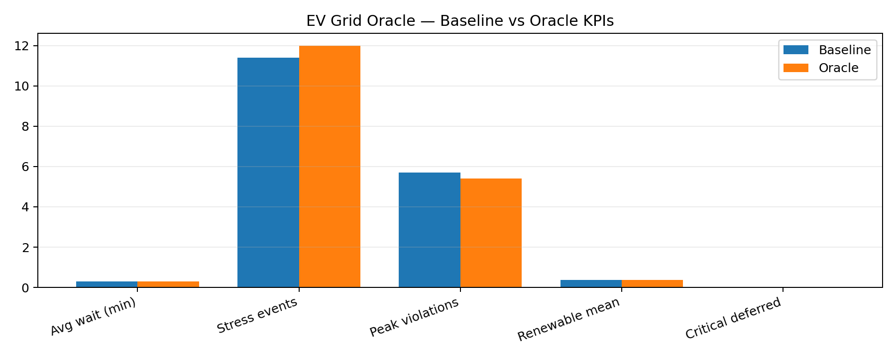

## EV Grid Oracle — Bangalore’s EV Dispatch “Oracle”

An **OpenEnv RL environment** that simulates Bangalore’s EV charging grid and trains a small LLM (Qwen2.5‑3B) with **verifiable GRPO rewards** to route EVs in real time — **lower queues**, **avoid feeder stress**, **shift load to renewables**.

- **Hackathon theme fit**: Theme #3 (**World Modeling**) + Theme #2 (**Long‑horizon planning**)  
- **Dual framing**: OpenEnv Hackathon + AI for Bharat (BESCOM Theme 9)

### Why judges will care (fast)
- **It’s verifiable**: every action parsed + validated; reward breakdown logged (anti‑hack by design).
- **It’s visual**: live “city map” with station heat, queues, arrows, HUD.
- **It shows learning**: baseline vs oracle KPIs + reward curves + replayable seeds.

---

## What’s in this repo

- **Environment (this Space)**: FastAPI server exposing `EVGridEnvironment` (OpenEnv interface).
- **Demo UI**: `viz/gradio_demo.py` (baseline vs oracle toggle + streaming “Run 60 ticks”).
- **2D recording**: `viz/city_map.py`, `viz/record_two_phase.py` (baseline → oracle 2‑minute frames).
- **Training**: `training/train_grpo.ipynb` (Colab T4 GRPO with verifier rewards).
- **Evidence**: `training/evaluate.py` (paired seeds + `per_episode` JSON) + `training/fair_eval.py` (Wilson CIs + `artifacts/fair_eval_chart.png`) + `training/make_plots.py` → `artifacts/kpi_comparison.png`.
- **Judge kit (repo-specific checklist)**: `docs/judge-kit/credit-assessment-pattern-map.md`

---

## Quick links (fill these in before submission)

- **OpenEnv Space (env)**: `https://huggingface.co/spaces/NITISHRG15102007/ev-grid-oracle`
- **Live host**: `https://nitishrg15102007-ev-grid-oracle.hf.space`
- **GitHub**: `https://github.com/NITISH-R-G/ev-grid-oracle`
- **Colab training notebook**: `https://colab.research.google.com/github/NITISH-R-G/ev-grid-oracle/blob/main/training/train_grpo.ipynb`
- **2‑minute video**: TODO (YouTube/HF post link)
- **LoRA repo**: `https://huggingface.co/NITISHRG15102007/ev-oracle-lora`

---

## The environment (OpenEnv)

This Space hosts the **OpenEnv‑compatible FastAPI server** for `EVGridEnvironment`.

### Endpoints

- `POST /reset`
- `POST /step`
- `GET /state`
- `GET /schema`
- `GET /health`

### Action format (strict)

The agent must respond in this exact schema (parsed by a deterministic regex):

```text
ACTION: route|defer|load_shift
STATION: BLR-01..BLR-25 or NONE
CHARGE_RATE: slow|fast|ultra_fast
DEFER_MINUTES: integer
REASON: max 20 words
CONFIDENCE: 0.0-1.0
```

### Reward (verifiable + anti‑hack)

Total reward is the sum of components (each logged) in `ev_grid_oracle/reward.py`:
- **wait**: penalize average station wait
- **grid_stress**: penalize overloaded stations (>85% capacity)
- **peak**: penalize feeder load > 80%, bonus below it
- **renewable**: reward green windows
- **urgency**: punish deferring critical EVs
- **anti‑hack**: punish impossible routes / queue piling

---

## Demo + Visualization

### Gradio demo (interactive)

Run locally:

```bash
python -m viz.gradio_demo
```

What judges see:
- map heat (green → red), queue dots, live KPIs
- mode toggle: baseline vs oracle
- **Run 60 ticks** streaming button (looks “alive”)

### Pygame cinematic map (for recording)

```bash
python -m viz.city_map
```

Press **SPACE** to advance simulation ticks.

### 2‑minute screen‑record pipeline (baseline → oracle)

```bash
python -m viz.record_two_phase --seed 123 --out artifacts/frames_2min
```

Then:

```bash
ffmpeg -framerate 30 -i frame_%06d.png -c:v libx264 -pix_fmt yuv420p out.mp4
```

---

## Evidence (baseline vs oracle)

KPI comparison plot:



Regenerate:

```bash
export ORACLE_LORA_REPO="NITISHRG15102007/ev-oracle-lora"  # set this on GPU machine / Colab
python -m training.evaluate --episodes 50 --out training/eval_results.json
python -m training.make_plots --eval-json training/eval_results.json --out-dir artifacts
```

Note: On CPU-only Windows, loading a 3B model can be slow or fail; in that case set `ORACLE_SKIP_LLM=1` for a fast sanity run, but **use Colab GPU** for the final “evidence of learning” artifacts.

---

## Training (Colab T4)

Open:
- `training/train_grpo.ipynb`

Notes:
- start with 1 epoch + small `num_generations`, then scale
- sample rollouts every N steps to detect reward hacking

> If you’re using LoRA/QLoRA, don’t naively upcast a 4-bit base to 16-bit and “merge” at the end without the correct path — it can badly degrade quality. Save adapters cleanly and test post-training inference immediately.

### Local dev

```bash
python -m uvicorn server.app:app --host 0.0.0.0 --port 8000
```

---

## Submission checklist (minimum requirements)

- [ ] OpenEnv env hosted on HF Space (this repo)
- [ ] Colab notebook runs end‑to‑end (GRPO + verifier reward)
- [ ] Baseline vs Oracle comparison (plot + numbers)
- [ ] Reward curves / logs (screenshot or committed PNG)
- [ ] < 2 minute video OR HF mini‑blog linked from this README

---

## Repo structure

```text
ev-grid-oracle/
├── openenv.yaml
├── pyproject.toml
├── ev_grid_oracle/
├── server/
├── training/
├── viz/
└── artifacts/
```

---

## Demo UI

The Gradio demo is in `viz/gradio_demo.py` (separate Space recommended).

