## EV Grid Oracle — Bangalore’s EV Dispatch “Oracle”

An **OpenEnv RL environment** that simulates Bangalore’s EV charging grid and trains a small LLM (Qwen2.5‑3B) with **verifiable GRPO rewards** to route EVs in real time — **lower queues**, **avoid feeder stress**, **shift load to renewables**.

### OpenEnv Hackathon 2026 — theme fit (pick a primary; justify in pitch)

| Theme | How EV Grid Oracle aligns |
|------|----------------------------|
| **#3 World modeling (primary)** | **Partially observable** grid + queues + **strict tool-like** actions; rewards come from **simulator + verifier** (`ev_grid_oracle/reward.py`), not from the model grading itself. Optional **world-model head** in training (`SimulationPrediction` + verifier in `training/train_grpo.ipynb`). |
| **#2 Long horizon (primary)** | Multi-step episodes (`reset` / `step` over many ticks), **delayed** stress from **scheduled scenarios** (`ev_grid_oracle/scenarios.py`), recovery from early mistakes visible in replay. |
| **#1 Multi-agent (primary)** | **Explicit multi-agent protocol**: **GridOperator** publishes a verifiable directive (`/ma/*`), **FleetDispatcher** routes EVs under that constraint, and we score **role rewards** + negotiation signal (`ev_grid_oracle/multi_agent.py`, `ev_grid_oracle/reward.py`). The demo UI includes **Judge Mode (MA)** with a negotiation timeline. |
| **#4 Self-improvement** | Scenario curriculum + trap catalog (`docs/judge-kit/trap-catalog.md`) are a hook for **adaptive difficulty**; training can reweight scenarios (future work). |
| **#5 Wild card** | Spatial **Bangalore graph** + **City Ops** demo + paired statistical eval are the differentiated story. |

**Dual framing:** OpenEnv Hackathon + AI for Bharat (BESCOM Theme 9).

### Judges — non‑negotiables (all links in one place)

Submissions are expected to meet the official checklist **with public URLs only** (do **not** commit large video binaries to the Hub Space repo).

| Requirement | Where |
|---------------|--------|
| **OpenEnv (build on the framework)** | This repo uses **`openenv-core>=0.2.3`** on [PyPI](https://pypi.org/project/openenv-core/) (current release line), plus [`openenv.yaml`](openenv.yaml) and the FastAPI server under `server/`. |
| **Runnable env on Hugging Face Spaces** | [**Space (card)**](https://huggingface.co/spaces/NITISHRG15102007/ev-grid-oracle) · [**Live app**](https://nitishrg15102007-ev-grid-oracle.hf.space) |
| **Training script (TRL + Unsloth, re‑runnable)** | [**Open in Colab**](https://colab.research.google.com/github/NITISH-R-G/ev-grid-oracle/blob/main/training/train_grpo.ipynb) · [Notebook on GitHub](https://github.com/NITISH-R-G/ev-grid-oracle/blob/main/training/train_grpo.ipynb) · same file in repo: [`training/train_grpo.ipynb`](training/train_grpo.ipynb) |
| **Evidence of real training (loss + reward)** | After a GPU run, TensorBoard logs land in `ev_oracle_grpo_road/`. Export PNGs: `python tools/export_grpo_tensorboard_plots.py --logdir ev_oracle_grpo_road --out-dir artifacts` → commit **`artifacts/grpo_loss.png`** and **`artifacts/grpo_reward.png`** (see [training artifacts doc](docs/submission/training-artifacts-and-logs.md)). *Until those exist from your run, add them before final submission.* |
| **Mini‑blog or under‑2‑minute video (link only)** | **Writeup:** [HF mini‑blog source (markdown)](https://github.com/NITISH-R-G/ev-grid-oracle/blob/main/docs/hf-mini-blog-ev-grid-oracle.md) — paste into a Hub post or link the raw file. **Video:** `https://youtu.be/yW1a1TrTZlI` — shot list: [`docs/submission/youtube-under-2min-outline.md`](docs/submission/youtube-under-2min-outline.md). |
| **Adapter weights (optional but linked)** | [LoRA on Hub](https://huggingface.co/NITISHRG15102007/ev-oracle-lora) |
| **Extra materials** | Judge kit: [`docs/judge-kit/credit-assessment-pattern-map.md`](docs/judge-kit/credit-assessment-pattern-map.md) · official resources: [`docs/hackathon-official-resources.md`](docs/hackathon-official-resources.md) |

**Eval / behavior evidence (complements GRPO curves):** paired baseline vs oracle plots live under `artifacts/` (see [Evidence & visualizations](#evidence--visualizations-baseline-vs-oracle--judge-pack) below).

### How this maps to judging (40 / 30 / 20 / 10)

| Criterion (weight) | What judges ask | Where we answer |
|--------------------|-----------------|-----------------|
| **Environment innovation (40%)** | Novel, hard to game, tests behavior | Graph routing + **anti-cheat flags**, deterministic **stress scenarios**, Phaser command center + replay (`web/`). |
| **Storytelling (30%)** | Problem → env → what changed → why it matters | This README + [`docs/hf-mini-blog-ev-grid-oracle.md`](docs/hf-mini-blog-ev-grid-oracle.md) + Space demo. |
| **Improvement in rewards / behavior (20%)** | Before vs after, same seeds | **Paired** `training/evaluate.py`, plots below, `training/fair_eval.py` (Wilson + McNemar on `per_episode`). |
| **Reward & pipeline (10%)** | Coherent reward, training hooks env | `ev_grid_oracle/reward.py` breakdown + `training/train_grpo.ipynb` (GRPO + `reward_fn` stepping `EVGridCore`). |

### Why judges will care (fast)
- **It’s verifiable**: every action parsed + validated; reward breakdown logged (anti‑hack by design).
- **It’s visual**: live “city map” with station heat, queues, arrows, HUD.
- **It shows learning**: baseline vs oracle KPIs + reward curves + replayable seeds.

---

## What’s in this repo

- **Environment (this Space)**: FastAPI server exposing `EVGridEnvironment` (OpenEnv interface).
- **Demo UI**: `viz/gradio_demo.py` (baseline vs oracle toggle + streaming “Run 60 ticks”).
- **2D recording**: `viz/city_map.py`, `viz/record_two_phase.py` (baseline → oracle 2‑minute frames).
- **Training**: `training/train_grpo.ipynb` (Colab T4 GRPO with verifier rewards).
- **Evidence**: paired `training/evaluate.py` + `training/fair_eval.py` + **`training/make_plots.py`** (multi-figure suite: KPIs, trajectories, deltas, breakdowns, boxplots, win rates, McNemar, dashboard — all under `artifacts/`).
- **Judge kit (repo-specific checklist)**: `docs/judge-kit/credit-assessment-pattern-map.md`
- **HF mini-blog (markdown article in repo)**: `docs/hf-mini-blog-ev-grid-oracle.md`
- **Official hackathon links (OpenEnv + HF Hub + tutorials + papers)**: `docs/hackathon-official-resources.md`
- **Trap catalog (scenarios + verifier flags)**: `docs/judge-kit/trap-catalog.md`
- **Local validation**: `./validate-submission.sh` → `assets/validation_output.txt` (gitignored; see `assets/README.md`)

### Web command center (`web/` + Space static UI)

- **Judge tour**: open the Space with `?tour=1` (combine with `seed`, `scenario`, `fleet`, `follow`, `lora`, `judge` query params).
- **Shareable state**: after **New** / **Step** / **Run**, the log prints a `share:` URL you can copy for the same seed/scenario.
- **Export JSON**: **Export JSON** downloads the recorded baseline/oracle step frames (map stills: use your OS screenshot tool).
- **Route rendering**: **traveled vs remaining** polyline styling; long OSM paths are **decimated** for smoother Deck.gl performance.

**Eval snapshot (no LLM):** `python tools/write_eval_snapshot.py` writes `artifacts/eval_snapshot.json` (paired baseline vs oracle with `ORACLE_SKIP_LLM=1`).

---

## Quick links (fill these in before submission)

- **OpenEnv Space (env)**: `https://huggingface.co/spaces/NITISHRG15102007/ev-grid-oracle`
- **Live host**: `https://nitishrg15102007-ev-grid-oracle.hf.space`
- **GitHub**: `https://github.com/NITISH-R-G/ev-grid-oracle`
- **Colab (opens `main` notebook on a clean VM)**: `https://colab.research.google.com/github/NITISH-R-G/ev-grid-oracle/blob/main/training/train_grpo.ipynb`
- **Notebook source (same file as Colab)**: `https://github.com/NITISH-R-G/ev-grid-oracle/blob/main/training/train_grpo.ipynb`
- **HF mini-blog / article (markdown in this repo — paste into a Hub post or link raw)**: `https://github.com/NITISH-R-G/ev-grid-oracle/blob/main/docs/hf-mini-blog-ev-grid-oracle.md`
- **2‑minute video**: `https://youtu.be/yW1a1TrTZlI` — shot list: [`docs/submission/youtube-under-2min-outline.md`](docs/submission/youtube-under-2min-outline.md)
- **LoRA repo**: `https://huggingface.co/NITISHRG15102007/ev-oracle-lora`

**Submission tips:** Hugging Face accepts long-form writeups as **markdown in your repo** (see `docs/hf-mini-blog-ev-grid-oracle.md`). Keep the **Colab link** and **GitHub `.ipynb` link** both in the README so judges can open Colab directly or review the notebook on GitHub. The training notebook’s **first code cell clones this repo and `pip install -e .`** so Colab runs stay reproducible.

### Submission bundle (env + training scripts + logs)

| Deliverable | Where |
|-------------|--------|
| Shared **environment** | HF Space + `openenv.yaml` (links above) |
| **Training script** | [`training/train_grpo.ipynb`](training/train_grpo.ipynb) (+ Colab quick link) |
| **Eval / fair-stats scripts** | `training/evaluate.py`, `training/fair_eval.py`, `training/make_plots.py` |
| **Training logs** (GRPO) | TensorBoard under `ev_oracle_grpo_road/` during a run; export PNGs or a console tail — **[`docs/submission/training-artifacts-and-logs.md`](docs/submission/training-artifacts-and-logs.md)** |
| **Eval evidence** (JSON + plots) | `training/eval_results.json`, `artifacts/fair_eval_results.json`, `artifacts/*.png` |
| **Video storyboard** | [`docs/submission/youtube-under-2min-outline.md`](docs/submission/youtube-under-2min-outline.md) |

### Official hackathon resources (OpenEnv + HF + tutorials)

Full list with descriptions: [`docs/hackathon-official-resources.md`](docs/hackathon-official-resources.md).

| Resource | Link |
|----------|------|
| OpenEnv Core (GitHub) | https://github.com/meta-pytorch/OpenEnV |
| OpenEnv docs | https://meta-pytorch.org/OpenEnv/ |
| HF OpenEnv environments | https://huggingface.co/openenv |
| HF OpenEnv Spaces | https://huggingface.co/openenv/spaces |
| Tutorials (tree) | https://github.com/meta-pytorch/OpenEnv/tree/main/tutorial |
| Training examples | https://github.com/meta-pytorch/OpenEnv/tree/main/tutorial/examples |
| Environment examples | https://github.com/meta-pytorch/OpenEnv/tree/main/envs |
| Reward papers | https://arxiv.org/abs/2408.10215 · https://arxiv.org/abs/2601.19100 |

**YouTube (RL envs):** [0airz7BhBiA](https://www.youtube.com/watch?v=0airz7BhBiA) · [ap4q4sAK4OY](https://www.youtube.com/watch?v=ap4q4sAK4OY) · [Jew4lhAiqnw](https://www.youtube.com/watch?v=Jew4lhAiqnw) · [kkCNMz0Ptd8 (live)](https://www.youtube.com/live/kkCNMz0Ptd8?si=JJ7og8x5qc7_Gi0e)

---

## The environment (OpenEnv)

This Space hosts the **OpenEnv‑compatible FastAPI server** for `EVGridEnvironment`.

### Endpoints

- `POST /reset`
- `POST /step`
- `GET /state`
- `GET /schema`
- `GET /health`

### Action format (strict)

The agent must respond in this exact schema (parsed by a deterministic regex):

```text
ACTION: route|defer|load_shift
STATION: BLR-01..BLR-25 or NONE
CHARGE_RATE: slow|fast|ultra_fast
DEFER_MINUTES: integer
REASON: max 20 words
CONFIDENCE: 0.0-1.0
```

### Road-graph RL (connected-edge actions)

This repo also includes a road-graph RL environment mounted under `POST /road/reset` and `POST /road/step`.
Its action schema is:

```text
CURRENT_NODE: <int>
NEXT_NODE: <int>
REASON: max 20 words
CONFIDENCE: 0.0-1.0
```

### Reward (verifiable + anti‑hack)

Total reward is the sum of components (each logged) in `ev_grid_oracle/reward.py`:
- **wait**: penalize average station wait
- **grid_stress**: penalize overloaded stations (>85% capacity)
- **peak**: penalize feeder load > 80%, bonus below it
- **renewable**: reward green windows
- **urgency**: punish deferring critical EVs
- **anti‑hack**: punish impossible routes / queue piling

---

## Demo + Visualization

### Gradio demo (interactive)

Run locally:

```bash
python -m viz.gradio_demo
```

What judges see:
- map heat (green → red), queue dots, live KPIs
- mode toggle: baseline vs oracle
- **Run 60 ticks** streaming button (looks “alive”)

### Pygame cinematic map (for recording)

```bash
python -m viz.city_map
```

Press **SPACE** to advance simulation ticks.

### 2‑minute screen‑record pipeline (baseline → oracle)

```bash
python -m viz.record_two_phase --seed 123 --out artifacts/frames_2min
```

Then:

```bash
ffmpeg -framerate 30 -i frame_%06d.png -c:v libx264 -pix_fmt yuv420p out.mp4
```

---

## Evidence & visualizations (baseline vs oracle — judge pack)

All figures below are generated from **`training/eval_results.json`** (`per_episode` rows = same world, two policies) and **`artifacts/fair_eval_results.json`**. Regenerate in one pass:

```bash
export ORACLE_LORA_REPO="NITISHRG15102007/ev-oracle-lora"   # optional; use GPU + real LoRA for separation
# ORACLE_SKIP_LLM=1  → baseline fallback inside oracle path (sanity / CI only)
python training/evaluate.py --episodes 72 --seed 7 --scenario baseline --out training/eval_results.json
python training/fair_eval.py --eval-json training/eval_results.json --out-json artifacts/fair_eval_results.json --out-chart artifacts/fair_eval_chart.png
python training/make_plots.py --eval-json training/eval_results.json --fair-json artifacts/fair_eval_results.json --out-dir artifacts
```

**How to read these when policies match:** if oracle falls back to baseline, trajectories and scatter collapse on top of each other — that proves **paired harness is correct**. After GRPO + LoRA, you want **divergence** on wait / peak / stress and **higher oracle win rates**.

### 1) Aggregate KPIs (mean over paired episodes)

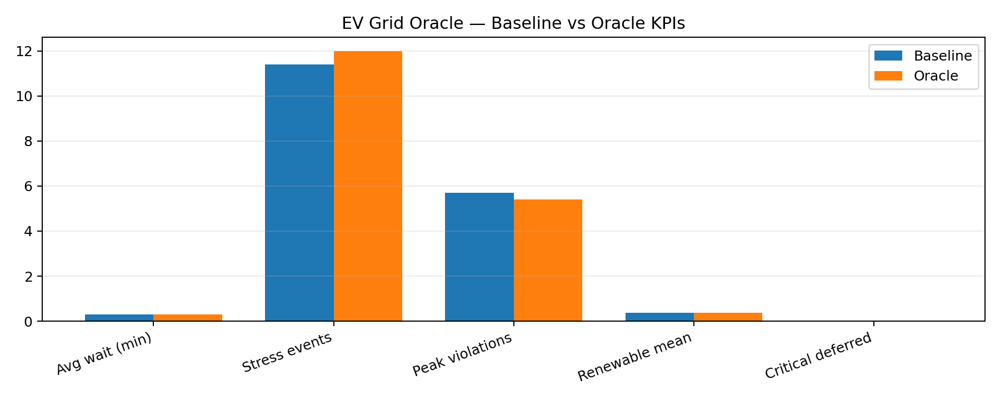

### 2) One-page dashboard (trajectory + deltas + scatter + win rate)

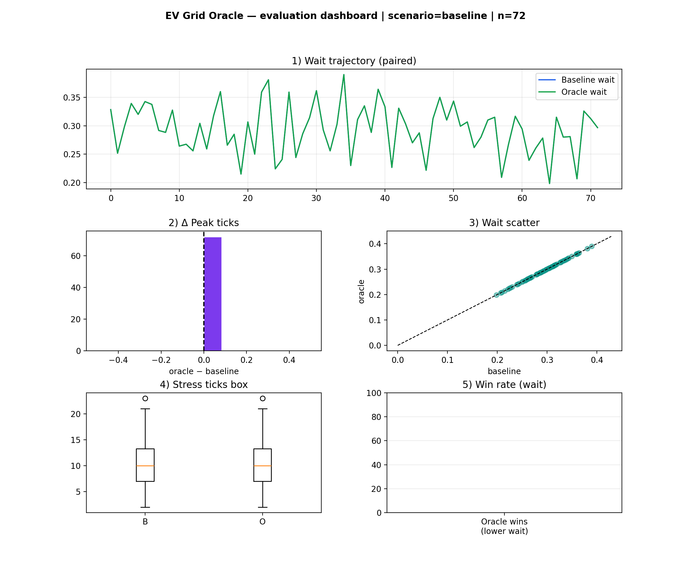

### 3) Per-episode trajectories (paired seeds)

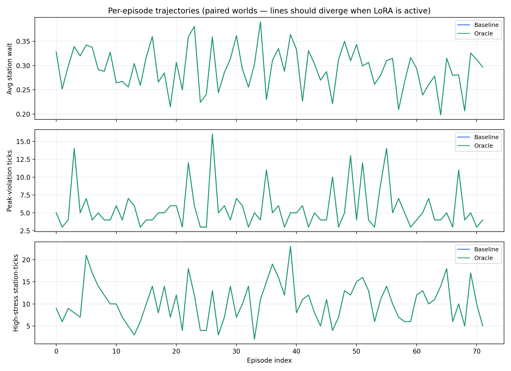

### 4) Paired deltas (oracle − baseline)

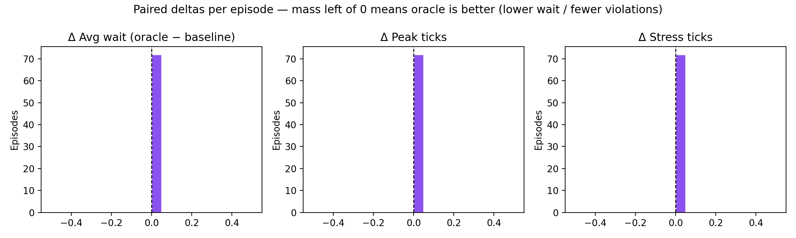

### 5) Verifier reward breakdown (mean components)

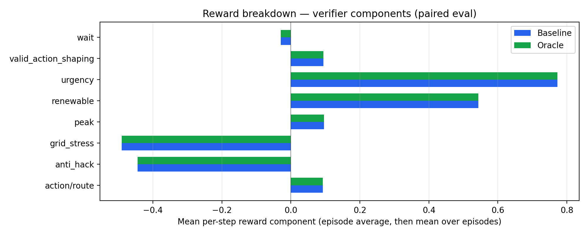

### 6) Distributions over episodes (boxplots)

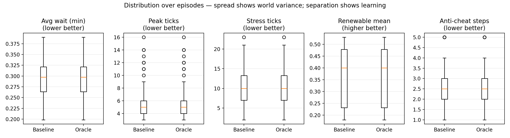

### 7) Head-to-head win rate (% episodes oracle wins outright)

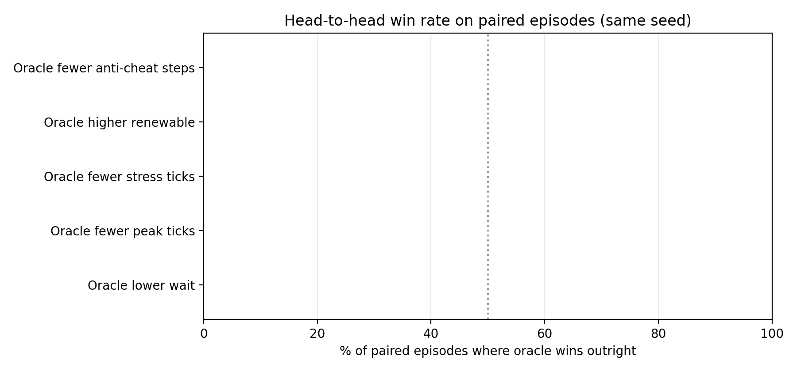

### 8) Paired scatter — wait (y = x means no change)

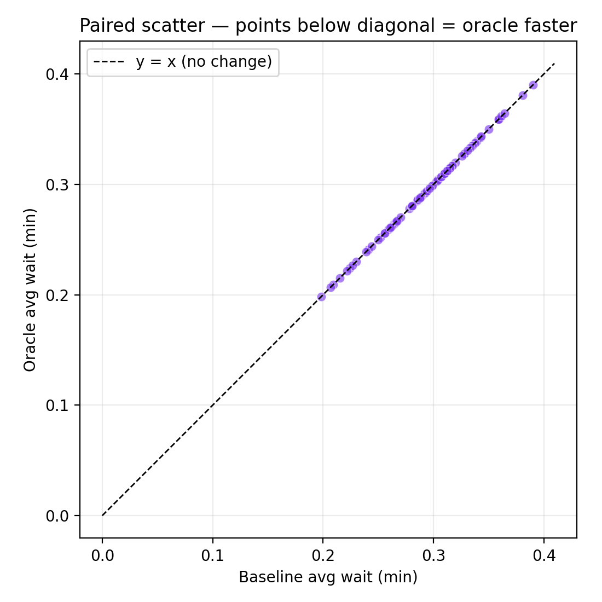

### 9) Baseline binary stress timeline (which episodes were “hard”)

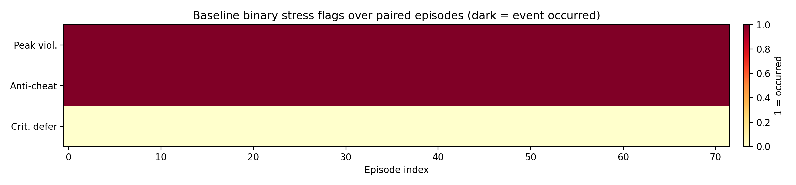

### 10) Wilson rates on binary outcomes (from `fair_eval_results.json`)

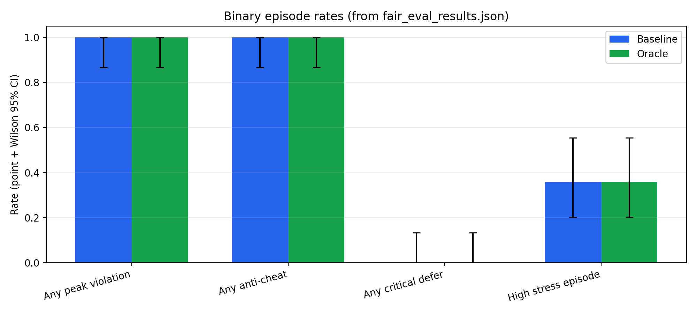

### 11) Wilson chart (errorbar plot from `fair_eval.py`)

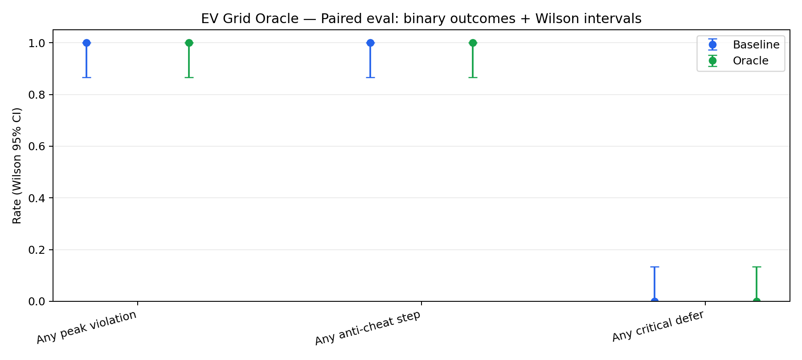

### 12) McNemar p-values (paired discordant-binomial test)

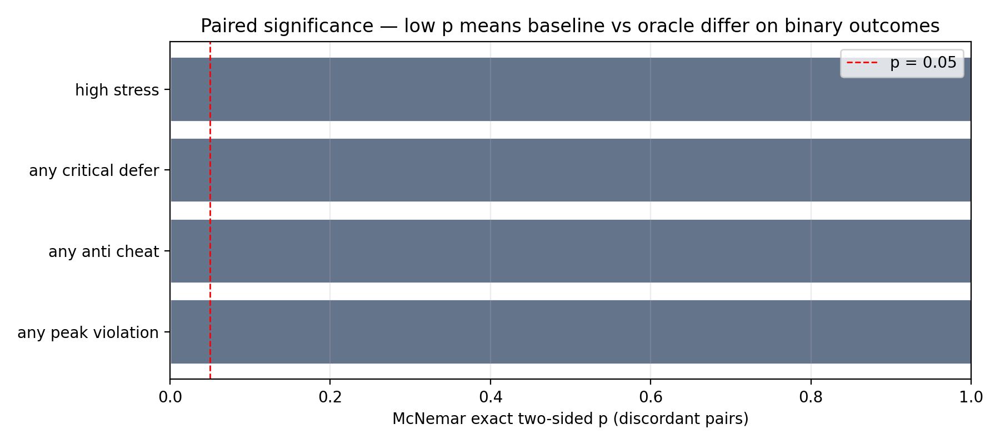

`artifacts/fair_eval_results.json` also stores **`paired_mcnemar`** tables for the full numeric report.

### GRPO training curves (loss / reward vs step)

TRL / Unsloth logs are most trustworthy when exported from a real run. In `training/train_grpo.ipynb`, `GRPOConfig` uses `report_to=["tensorboard"]` (logs under `ev_oracle_grpo_road/`). Train on GPU, then add **exported PNGs** (`artifacts/grpo_loss.png`, `artifacts/grpo_reward.png` via `tools/export_grpo_tensorboard_plots.py` or TensorBoard screenshots) or a console tail under `artifacts/training_logs/` — see [`docs/submission/training-artifacts-and-logs.md`](docs/submission/training-artifacts-and-logs.md). Judges reward **labeled axes** and **same-run** comparisons.

Note: On CPU-only machines, loading a 3B model can be slow or fail; use **Colab GPU** for final “evidence of learning” artifacts and training curves.

---

## Training (Colab T4)

Open:
- `training/train_grpo.ipynb`

**Winning tip:** Prefer a **small** base model and **many** short training iterations over squeezing a huge model into memory for one or two lucky runs. Judges weight **environment quality**, **clear reward signals**, and **evidence** (curves, paired eval) more than raw parameter count. Use **QLoRA**, budget GPU time, tighten the env loop first—then scale `num_generations` / epochs when rollouts are stable.

Notes:
- start with 1 epoch + small `num_generations`, then scale
- sample rollouts every N steps to detect reward hacking

> If you’re using LoRA/QLoRA, don’t naively upcast a 4-bit base to 16-bit and “merge” at the end without the correct path — it can badly degrade quality. Save adapters cleanly and test post-training inference immediately.

### Local dev

```bash
python -m uvicorn server.app:app --host 0.0.0.0 --port 8000
```

### HF Space: redeploy from `main`

- **Restart / rebuild (API):** with a Hub token installed locally, `python -c "from huggingface_hub import HfApi; HfApi().restart_space('NITISHRG15102007/ev-grid-oracle')"` queues a new build from the Space’s configured source revision.  
- **`git push hf main`:** the Space git remote often **rejects** pushes that contain **binary PNGs** under `artifacts/` (Hub Xet policy). **Docker Spaces usually do *not* show a “Link GitHub repository” block** in Settings — only hardware, secrets, restart, factory rebuild, etc. That is normal.  
- **Recommended sync:** push code to GitHub as usual, then from repo root run  
  `python tools/sync_space_to_hub.py`  
  (builds `web/dist` and **uploads the tree via Hub API**, ignoring `artifacts/`, `node_modules`, `.git`, …). Then use **Restart** or **Factory rebuild** on the Space if needed. Set `HF_SPACE_REPO_ID` if your Space name differs.

### HF Space: “Oracle loading forever” / frozen UI

1. **Road GeoJSON 404:** the UI is mounted at **`/ui/`**; map tiles must load from **`/ui/maps/...`**. If the map never draws and “New” stalls, check the browser network tab for **`/maps/...` (404)** — that was a known bug; rebuild/redeploy the Space from a commit that includes the `staticAssetUrl(...)` fix in `web/src/phaser/PixelCityScene.ts`.
2. **LoRA repo typo:** the Hub user is **`NITISHRG15102007`** (letters **HR**). `NITISHGR…` will 404 or hang on retries. The Command Center pre-fills the correct id; edit only if you use another adapter repo.  
3. **First `STEP` downloads Qwen2.5‑3B + LoRA on CPU** — can exceed a minute. The server now runs oracle inference in a **thread with timeout** (`DEMO_ORACLE_INFERENCE_TIMEOUT_SEC`, default **120s** in the Docker image) and falls back to **baseline** with badge **TIMEOUT→baseline** instead of wedging the browser.  
4. **`ORACLE_SKIP_LLM=1`** on the Space forces an instant oracle path (baseline policy) for demos when you do not need on-Space LLM inference.  
5. **“New” no longer auto-runs the first step** — click **STEP** once maps are ready so the page does not block on model load during session creation.

---

## Submission checklist (OpenEnv India 2026 — non‑negotiables)

- [ ] **OpenEnv (current stack):** `openenv.yaml` + `openenv-core` per `pyproject.toml`; env runnable from **HF Space URL** (submit this URL).
- [ ] **Training:** Colab **or** repo path — [`training/train_grpo.ipynb`](training/train_grpo.ipynb) + [Open in Colab](https://colab.research.google.com/github/NITISH-R-G/ev-grid-oracle/blob/main/training/train_grpo.ipynb) using **Unsloth / TRL**.
- [ ] **Evidence of real training:** committed **readable plots** (axes interpretable) — full **Evidence & visualizations** gallery above + **GRPO logs** (TensorBoard screenshots and/or `artifacts/training_logs/` — see [`docs/submission/training-artifacts-and-logs.md`](docs/submission/training-artifacts-and-logs.md)); link Wandb/Trackio **per run** if you use them.
- [ ] **Writeup:** **HF mini-blog** ([`docs/hf-mini-blog-ev-grid-oracle.md`](docs/hf-mini-blog-ev-grid-oracle.md)) **or** an **under 2 minute** video (YouTube/HF) — **link only** (no large video files in the Space repo).
- [ ] **README:** motivates **problem**, explains **env + reward**, shows **results**, says **why it matters**; includes **Space + Colab + blog/video + LoRA** links (see Quick links).
- [ ] **One submission per team:** freeze the Space URL you give judges; avoid post-deadline reliance on unpinned `main` unless rules allow.

---

## Repo structure

```text
ev-grid-oracle/
├── openenv.yaml
├── pyproject.toml
├── ev_grid_oracle/
├── server/
├── training/
├── viz/
└── artifacts/
```

---

## Demo UI

### Phaser Command Center (this Space)

- Open the UI at `/ui/` on the Space.
- Click **Judge Mode (MA)** to run the **explicit multi-agent** demo path:
  - GridOperator sends a directive (constraint) + message
  - FleetDispatcher routes under constraints (baseline vs oracle)
  - UI shows the negotiation timeline + role reward totals

### Gradio (optional separate Space)

The Gradio demo is in `viz/gradio_demo.py` (separate Space recommended).

---

## Continuous Engineering & Agile Workflow

This repository strictly follows an **Agile Scrum continuous improvement methodology**. Our objective is to treat this repository as a living, elite engineering product. Every improvement cycle operates on a fixed loop:

1. **Analyze**: Identify tech debt, missing features, or missing optimizations.
2. **Benchmark**: Perform competitor analysis against top-tier open source tools.
3. **Plan**: Output a clear Sprint Plan and prioritize work by impact (Repository Health Reports).
4. **Execute**: Maintain strong coding standards (SOLID, DRY, `ruff` linting, and 100% type-safety using `mypy`).
5. **Review**: Produce automated reports containing the Metrics Improved.

To participate, contributors must respect local validation tools via `./validate-submission.sh`. No code is merged unless it passes formatting, type checking, and test suites. See `CYCLE_1_REPORT.md` for our current sprint benchmarks.

## Auto-Generated API Reference

### ./test_script.py

### Class `ChargerType`
### Class `StationState`
### ./viz/record_two_phase.py

### Function `_step_action`
### Function `record_phase`
### Function `main`
### ./viz/record.py

### Function `record`
Record frames as PNGs.

- `tick_every_frames`: how many frames to show per env.step() (slows animation, looks smoother).

### Function `main`
### ./viz/gradio_demo.py

### Function `_norm`
### Function `_station_color`
### Function `render_map`
### Class `Session`
### Function `new_session`
### Function `step_once`
### Function `compute_kpis`
### ./viz/city_map.py

### Function `_station_color`
### Function `_norm`
### Class `RenderConfig`
### Class `CityMapRenderer`
### Function `run_live`
### ./ev_grid_oracle/road_env.py

### Class `RoadCore`
### ./ev_grid_oracle/road_models.py

### Class `RoadAction`
Minimal action space for RL on a real road graph:
choose the next connected node (no teleportation).

### Class `RoadState`
### Class `RoadObservation`
### ./ev_grid_oracle/personas.py

### Class `PersonaParams`
### Function `choose_persona`
### ./ev_grid_oracle/models.py

### Class `ChargerType`
### Class `ChargeRate`
### Class `ActionType`
### Class `DayType`
### Class `PeakRisk`
### Class `StationState`
### Class `EVRequest`
### Class `BESCOMFeederState`
Lightweight, judge-friendly feeder snapshot (mocked but deterministic).

### Class `GridState`
### Class `EVGridAction`
### Class `EVGridObservation`
### Class `NegotiationMessage`
A short, bounded message used in the explicit multi-agent protocol.

This is *not* a free-form chat reward. It exists so judges can see
negotiation/constraints explicitly and we can penalize empty spam.

### Class `GridDirective`
GridOperator -> FleetDispatcher constraint signal (verifiable).

### Class `MultiAgentStepRequest`
### Class `MultiAgentStepResponse`
### Class `SimTopStation`
### Class `SimulationPrediction`
Aggregated 'dream state' prediction for T+5 ticks.
Kept intentionally small and verifiable for hackathon judging.

### Function `to_jsonable`
### ./ev_grid_oracle/parsing.py

### Function `parse_simulation`
### Function `parse_action`
### Function `parse_simulation_and_action`
Parse both dream prediction and action (either can be missing).

### ./ev_grid_oracle/demand_sim.py

### Class `DemandParams`
### Function `_gaussian_bump`
### Function `expected_arrivals_per_step`
### Function `sample_arrivals_per_step`
### ./ev_grid_oracle/reward_hack.py

### Class `RewardHackDetector`
Stateful, deterministic detector for common reward-hacking patterns.

Goal: give the existing anti-hack flags "teeth" by detecting multi-step
exploit patterns, not just single-step invalidity.

### ./ev_grid_oracle/env.py

### Class `EVGridCore`
Core env logic (no HTTP). Server wraps this.

v0 slice: deterministic schema, minimal dynamics.
Next slices add demand_sim/grid_sim/reward engine.

### Function `_peak_risk`
### Function `_make_ev`
### Function `_apply_action`
### Function `_drain_queues_and_charging`
### Function `_update_station_waits`
### Function `_build_prompt`
### ./ev_grid_oracle/policies.py

### Function `baseline_policy`
Greedy baseline: pick station minimizing (travel_time + wait + stress + price), avoid full.

Deterministic given state.

### Function `always_defer_policy`
Collapse baseline: always defer (reward-hack / fairness stressor).

### Function `always_load_shift_policy`
Collapse baseline: always load_shift on head EV (ignores queues / grid).

### Function `nearest_travel_only_policy`
Collapse baseline: minimize travel time only (ignores price, wait, stress).
Used to show greedy multi-objective baseline is not trivially dominated.

### ./ev_grid_oracle/multi_agent.py

### Class `MultiAgentSession`
Minimal explicit multi-agent wrapper around EVGridCore.

- GridOperator emits a directive (constraint signal) + optional message.
- FleetDispatcher emits an action + optional message.
- Resolver applies directive deterministically and steps EVGridCore.

### ./ev_grid_oracle/grid_sim.py

### Class `GridParams`
### Function `_clamp01`
### Function `baseline_grid_load`
### Function `renewable_pct`
### Function `update_grid_load`
### ./ev_grid_oracle/reward.py

### Class `RewardWeights`
### Function `_haversine_km`
### Function `_graph_route_km`
Approximate driving distance along the city graph using haversine edge weights.
Returns None if no path exists.

### Function `compute_reward`
Deterministic, verifier-style reward with breakdown.

Matches hackathon spec: wait, grid_stress, peak, renewable, urgency, anti-hack.

### Function `split_role_rewards`
Deterministic role-level reward views derived from the same underlying breakdown.

This is intentionally simple and bounded (judge-friendly): it does not claim
full MARL credit assignment, but it does make incentives explicit.

### ./ev_grid_oracle/oracle_agent.py

### Class `OracleRuntime`
Singleton-style loader that prefers CUDA when available.

This keeps T4 Spaces fast and makes oracle behavior undeniable.

### Class `OracleAgent`
Oracle agent wrapper.

Default: baseline fallback (always available).
Optional: load a trained LoRA adapter when `lora_repo_id` provided.

### ./ev_grid_oracle/bescom_feed.py

### Class `BESCOMFeedAPI`
Deterministic BESCOM feeder "API mock".

- No network calls (HF Spaces safe).
- Feeder loads are derived from: time-of-day + grid_load_pct + station loads.
- Output is stable under (seed, scenario, tick) so judge replays match.

### ./ev_grid_oracle/scenarios.py

### Class `ScenarioEvent`
### Class `ScenarioModifiers`
Lightweight knobs applied on top of the core simulator.
These are intentionally simple and deterministic for replayable judging.

### Function `scenario_schedule`
Deterministic, fixed-tick stress tests (OpenOfficeRL-style).

Note: ticks are env steps (5-minute increments by default).

### Function `apply_scenario_events`
Returns updated modifiers and the list of events that fired this tick.

### ./ev_grid_oracle/traffic.py

### Function `_clamp`
### Function `_stable_u01`
Stable pseudo-random in [0,1) from input parts.
Deterministic across processes and Python versions.

### Class `TrafficModel`
Deterministic synthetic traffic for hackathon demos.

Returns a multiplier m in [0.35, 1.15] to scale base travel_s on an edge.

### ./ev_grid_oracle/world_model_verifier.py

### Class `PredictionScore`
### Function `_top3`
### Function `rollout_deterministic_5ticks`
Deterministic verifier rollout: apply action once, then advance 5 ticks with *no new arrivals*.
This is intentionally verifier-friendly (stable + reproducible) for RLVR.

### Function `score_prediction`
Score dream-state prediction accuracy against a deterministic T+5 verifier rollout.
Returns score in [0,1].

### ./ev_grid_oracle/city_graph.py

### Class `StationSpec`
### Function `get_station_by_id`
### Function `get_station_by_slug`
### Function `haversine_km`
### Function `_edge_minutes`
### Function `_add_chain_edges`
### Function `_add_dense_within_cluster`
### Function `build_city_graph`
### Function `travel_time_minutes`
### Function `nearest_stations_by_geo`
### ./server/role_metrics.py

### Function `compute_role_kpis`
### Function `compute_role_reward_breakdown`
Lightweight, explainable credit assignment for demo storytelling.

This is NOT a full MARL credit assignment — it allocates the *same* component
values across roles with fixed weights so totals remain easy to interpret.

### Function `_peak_risk_score`
### Function `summarize_action`
### ./server/app.py

### Function `_request_id`
### Function `_oracle_skip_llm_env`
### Function `_rate_limit`
### Function `_demo_oracle_act_with_guard`
Run oracle policy with CPU-Space-safe guards.

Returns: action, oracle_text, oracle_llm_active, oracle_timed_out, oracle_skipped_env

### Function `root`
### Function `healthz`
HF Spaces / cold-start friendly health endpoint.
Keep it fast and dependency-safe (no heavy routing work).

### Function `_osm_route_polyline`
### Function `_graph_route_polyline`
Return a render-friendly polyline (lat/lng pairs) along the station graph.
v0 fallback was a straight line; this produces a multi-point path so the UI reads like navigation.

### Function `_spawn_road_point_away_from_stations`
Pick a deterministic road-graph node location (lat,lng) that is not within
`min_station_dist_m` of any station. Deterministic for a given seed_key.

### Function `_demo_session_gc`
### Function `_demo_session_get`
### Class `DemoNewRequest`
### Function `_ma_gc`
### Function `_ma_get`
### Class `MANewRequest`
### Function `ma_new`
### Function `_grid_policy`
### Class `MAAutoStepRequest`
### Function `ma_auto_step`
### Function `ma_state`
### Function `ma_step`
### Function `_obs_to_jsonable`
### Function `_station_nodes`
### Function `demo_new`
### Function `demo_state`
### Class `DemoSpawnVehicleRequest`
### Function `demo_spawn_vehicle`
Spawn a new EV at a valid road location (away from stations) and immediately compute
an assignment + route event for the frontend.

### Function `demo_step`
### Function `main`
### ./server/ev_grid_road_environment.py

### Class `EVGridRoadEnvironment`
Separate OpenEnv environment that forces real-road-graph actions.
Mounted as a sub-app under /road/ so it doesn't break the existing env.

### ./server/road_router.py

### Function `haversine_m`
### Function `decode_polyline_latlng`
### Class `RoadRouter`
### Function `get_router`
### ./server/ev_grid_environment.py

### Class `EVGridEnvironment`
### ./.cursor/skills/generate-openenv-env/assets/openenv_env_template/models.py

### Class `__ENV_CLASS_NAME__Action`
Action for the __ENV_TITLE_NAME__ environment - just a message to echo.

### Class `__ENV_CLASS_NAME__Observation`
Observation from the __ENV_TITLE_NAME__ environment - the echoed message.

### ./.cursor/skills/generate-openenv-env/assets/openenv_env_template/client.py

### Class `__ENV_CLASS_NAME__Env`
Client for the __ENV_TITLE_NAME__ Environment.

This client maintains a persistent WebSocket connection to the environment server,
enabling efficient multi-step interactions with lower latency.
Each client instance has its own dedicated environment session on the server.

Example:
    >>> # Connect to a running server
    >>> with __ENV_CLASS_NAME__Env(base_url="http://localhost:8000") as client:
    ...     result = client.reset()
    ...     print(result.observation.echoed_message)
    ...
    ...     result = client.step(__ENV_CLASS_NAME__Action(message="Hello!"))
    ...     print(result.observation.echoed_message)

Example with Docker:
    >>> # Automatically start container and connect
    >>> client = __ENV_CLASS_NAME__Env.from_docker_image("__ENV_NAME__-env:latest")
    >>> try:
    ...     result = client.reset()
    ...     result = client.step(__ENV_CLASS_NAME__Action(message="Test"))
    ... finally:
    ...     client.close()

### ./.cursor/skills/generate-openenv-env/assets/openenv_env_template/server/app.py

### Function `main`
Entry point for direct execution via uv run or python -m.

This function enables running the server without Docker:
    uv run --project . server
    uv run --project . server --port 8001
    python -m __ENV_NAME__.server.app

Args:
    host: Host address to bind to (default: "0.0.0.0")
    port: Port number to listen on (default: 8000)

For production deployments, consider using uvicorn directly with
multiple workers:
    uvicorn __ENV_NAME__.server.app:app --workers 4

### ./.cursor/skills/generate-openenv-env/assets/openenv_env_template/server/__ENV_NAME___environment.py

### Class `__ENV_CLASS_NAME__Environment`
A simple echo environment that echoes back messages.

This environment is designed for testing the HTTP server infrastructure.
It maintains minimal state and simply echoes back whatever message it receives.

Example:
    >>> env = __ENV_CLASS_NAME__Environment()
    >>> obs = env.reset()
    >>> print(obs.echoed_message)  # "__ENV_TITLE_NAME__ environment ready!"
    >>>
    >>> obs = env.step(__ENV_CLASS_NAME__Action(message="Hello"))
    >>> print(obs.echoed_message)  # "Hello"
    >>> print(obs.message_length)  # 5

### ./tests/test_models_and_graph.py

### Function `test_city_graph_connected_and_25_stations`
### Function `test_action_route_requires_station_id_and_zero_defer`
### Function `test_action_defer_requires_positive_defer_minutes`
### Function `test_time_advances_with_5min_steps`
### ./tests/test_policies_collapse.py

### Function `_run_policy`
### Function `test_collapse_policies_do_not_crash`
### Function `test_collapse_policies_return_valid_actions_when_pending`
### ./tests/test_evaluate_paired.py

### Function `_chdir_repo_root`
### Function `test_baseline_rollout_identical_for_same_seed_and_scenario`
### Function `test_oracle_matches_baseline_when_skip_llm`
### Function `test_evaluate_cli_paired_json`
### Function `test_fair_eval_cli`
### ./tests/test_world_model_verifier.py

### Function `test_rollout_deterministic_is_stable`
### Function `test_prediction_score_higher_when_close`
### ./tests/test_parsing.py

### Function `test_parse_simulation_valid`
### Function `test_parse_simulation_missing_match`
### Function `test_parse_simulation_exception_handling`
### ./tests/test_reward.py

### Function `test_reward_breakdown_has_keys_and_total`
### Function `test_deferring_critical_ev_penalized`
### Function `test_invalid_station_routes_penalized`
### Function `test_split_role_rewards_exception_handling`
### ./tests/test_env_determinism.py

### Function `test_reset_state_identical_two_cores_same_seed`
### Function `test_step_sequence_identical_two_cores_same_actions`
### Function `test_ev_grid_action_rejects_malformed_payload`
### Function `test_route_action_requires_station`
### ./tests/test_demo_api.py

### Function `test_demo_new_and_step_roundtrip`
### Function `test_demo_spawn_vehicle_route_event`
### Function `test_demo_step_forced_action_validation_422`
### Function `test_health_shape`
### Function `test_demo_sessions_ttl_eviction`
### Function `test_ma_new_and_step_roundtrip`
### ./tests/test_fair_eval_mcnemar.py

### Function `test_mcnemar_no_discordant_is_neutral`
### Function `test_mcnemar_strong_asymmetry_low_p`
### Function `test_paired_mcnemar_analysis_shape`
### ./training/fair_eval.py

### Function `_binom_two_sided_exact_p`
Two-sided exact test for Binomial(n, p); used for McNemar discordant pairs (p=0.5).

### Function `mcnemar_discordant`
McNemar on paired binary outcomes.
b01 = count(baseline True, oracle False); b10 = count(baseline False, oracle True).

### Function `paired_mcnemar_analysis`
Paired McNemar for headline binaries (same rows as Wilson chart).

### Function `wilson_interval`
Wilson score interval for a binomial proportion.
Returns (low, high, p_hat). For n==0 returns (nan, nan, nan).

### Function `_binary_keys`
### Function `analyze_per_episode`
### Function `_paired_improvement_counts`
Operational 'wins' where oracle strictly improves a binary bad outcome vs baseline.

### Function `plot_fair_eval`
Bar chart: select headline baseline vs oracle binary rates with Wilson error bars.

### Function `main`
### ./training/make_plots.py

### Function `_boxplot_compat`
### Function `_per_episode_rows`
### Function `plot_kpi_bars`
### Function `plot_episode_trajectories`
### Function `plot_delta_histograms`
### Function `plot_reward_breakdown`
### Function `plot_boxplots`
### Function `plot_oracle_win_rates`
### Function `plot_paired_scatter`
### Function `plot_binary_timeline`
### Function `plot_fair_eval_rates`
### Function `plot_mcnemar_summary`
### Function `plot_dashboard_grid`
### Function `main`
### ./training/evaluate.py

### Class `EpisodeMetrics`
### Function `_episode_metrics_to_json`
### Function `run_episode`
### Function `summarize`
### Function `summarize_reward_breakdown`
### Function `main`
### ./tools/docs_sync.py

### Function `extract_api_info`
### Function `update_readme`
### ./tools/fetch_bangalore_roads_overpass.py

### Function `_chunk`
### Function `_overpass_query`
### Function `_tile_bbox`
### Function `_http_post`
### Function `_to_geojson`
### Function `main`
### ./tools/export_grpo_tensorboard_plots.py

### Function `_pick_tags`
### Function `main`
### ./tools/build_roads_render.py

### Function `main`
### ./tools/sync_space_to_hub.py

### Function `main`
### ./tools/write_eval_snapshot.py

### Function `main`
### ./tools/generate_knowledge_graph.py

### Function `generate_knowledge_graph`
### ./tools/generate_health_dashboard.py

### Function `run_cmd`
### Function `get_git_stats`
### Function `get_leaderboard`
### Function `get_documentation_health`
### Function `fetch_github_stats`
### Function `run_pytest_cov`
### Function `run_radon`
### Function `run_bandit`
### Function `run_ruff`
### Function `calculate_health_scores`
### Function `generate_ai_insights`
### Function `main`
### ./tools/build_road_graph.py

### Function `haversine_m`
### Function `_encode_signed`
### Function `encode_polyline_latlng`
Google polyline encoding for [lat,lng] points.
Stored as a compact ASCII string to shrink graph artifacts.

### Function `speed_kmh`
### Class `Node`
### Function `snap`
### Function `_coords_latlng_from_geojson_line`
### Function `parse_args`
### Function `build_adjacency`
Pass 1: build point adjacency over snapped coordinates.
Intersections/endpoints are nodes where degree != 2.

### Function `contract_edges`
Pass 2: for each way, contract degree-2 chains into intersection-to-intersection edges.

### Function `filter_largest_component`
Pass 3: Keep only the largest connected component (by node count) to satisfy routing coverage.

### Function `main`
### ./tools/road_reward_smoke.py

### Function `main`
### ./tools/fetch_osm_roads.py

### Class `BBox`
### Function `_fetch_overpass`
### Function `_simplify_line`
### Function `_to_feature_collection`
### Function `build_query`
### Function `main`
### ./tools/prune_osm_geojson.py

### Function `_pad_bbox`
### Function `_line_intersects_bbox`
### Function `_simplify_uniform`
### Function `main`
